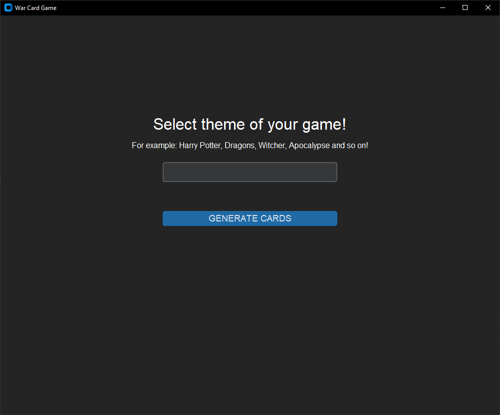
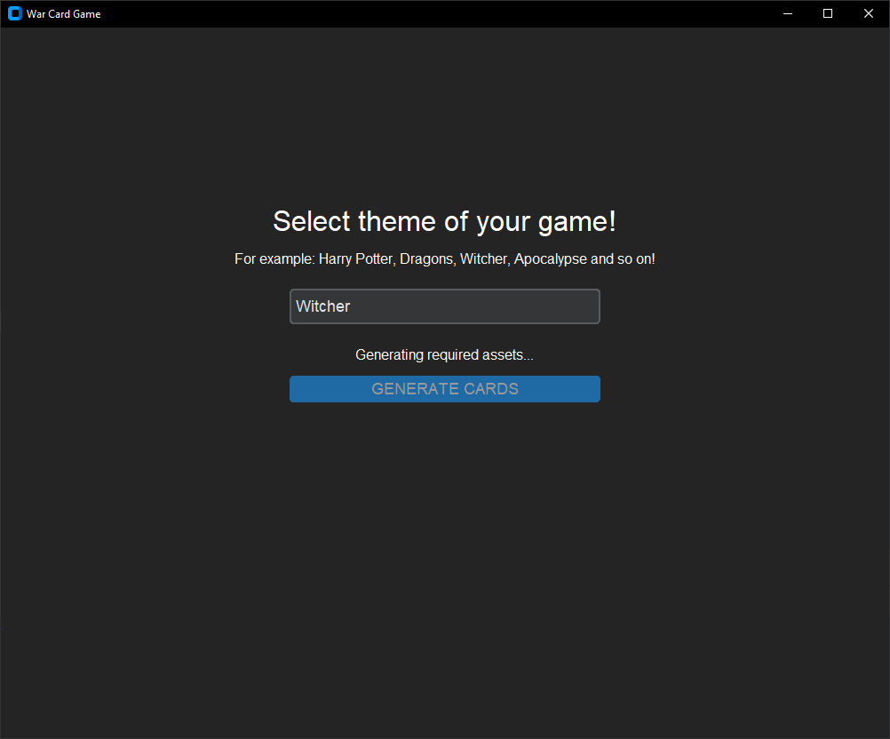
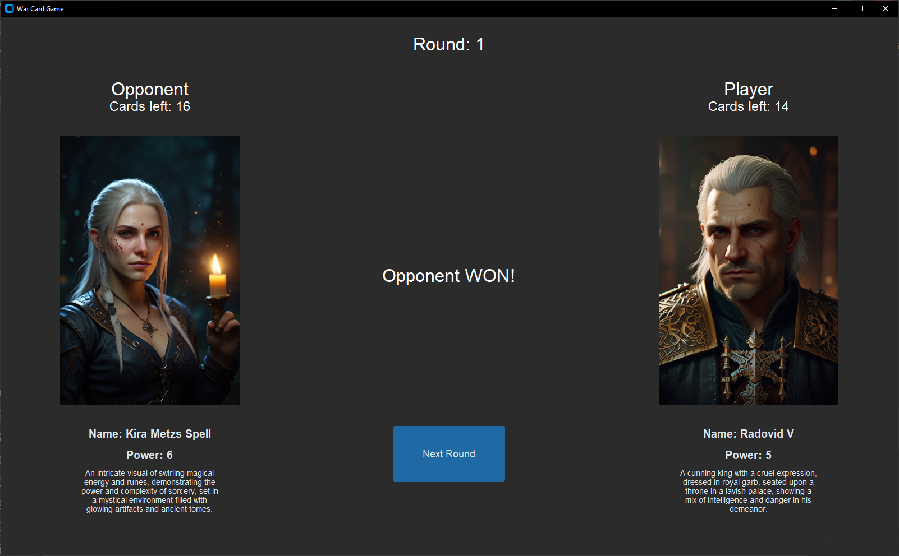
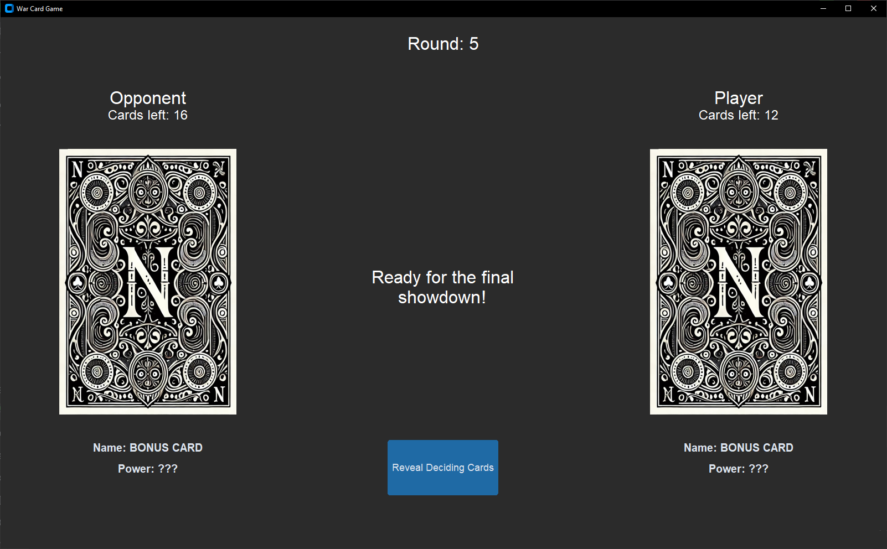
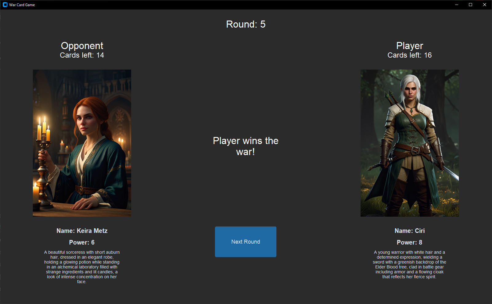
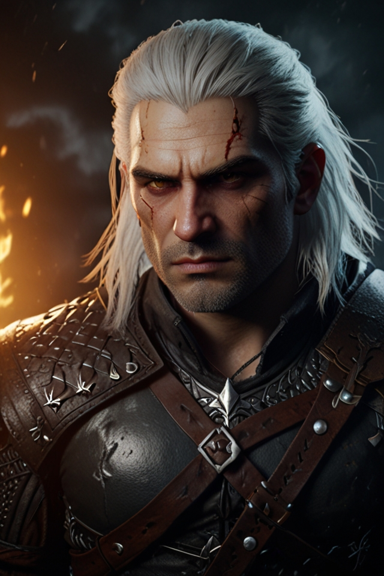
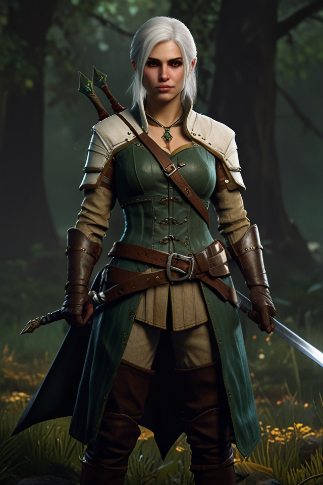
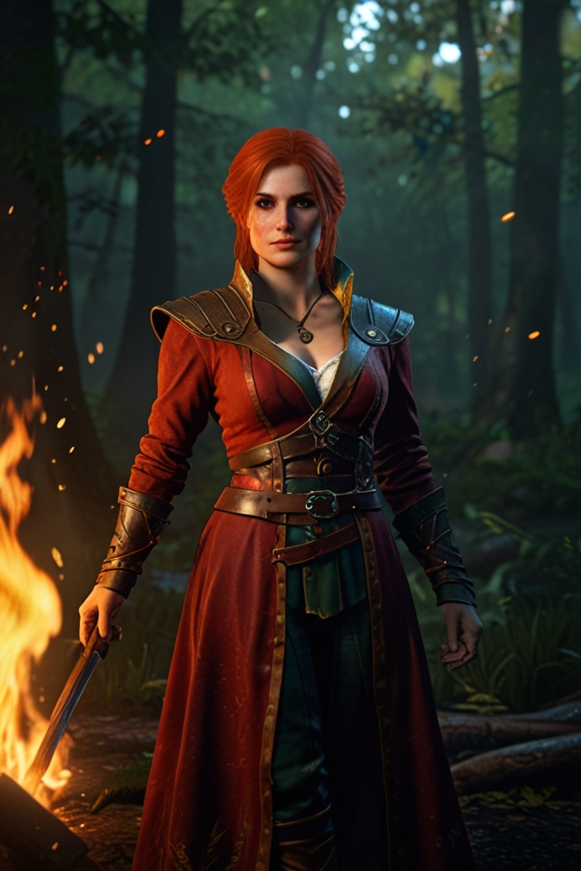

# WarCardGameAI

Welcome to WarCardGameAI! This project revitalizes the classic "War" card game by integrating advanced artificial intelligence. Players can choose a theme, and the game dynamically generates cards with unique descriptions and images based on that theme. This project showcases skills in Python programming, API integration, GUI development, and version control.

## Table of Contents
1. [Features](#features)
2. [Screenshots](#screenshots)
3. [Installation](#installation)
4. [Usage](#usage)
5. [Development](#development)
6. [Skills and Learning Outcomes](#skills-and-learning-outcomes)
7. [Deployment](#deployment)
8. [License](#license)
9. [Contact](#contact)

## Features
- **AI-Generated Content**: Dynamically creates card names, powers, and descriptions based on the selected theme using OpenAI's ChatGPT API.
- **Custom Visuals**: LeonardoAI API generates unique images for each card, ensuring alignment with the chosen theme.
- **Intuitive GUI**: A modern and user-friendly interface built with the CustomTkinter library.
- **Error Handling**: Comprehensive error handling ensures smooth gameplay.
- **Theme Customization**: Players can choose any theme he thinks of

## Screenshots

### Theme Selection Window


### Theme Generation in Progress


### Main Game Window - After Round


### War Bonus Cards


### War Result Window


### Example of Generated Cards





## Installation
### System Requirements:
- Python 3.7 or higher
- Internet connection for API access

### Step-by-Step Installation:
1. Clone the Repository:
   ```bash
   git clone https://github.com/kwasniewskin/WarCardGameAI.git
   ```
2. Navigate to the Project Directory:
   ```bash
   cd WarCardGameAI
   ```
3. Install Required Dependencies:
   ```bash
   pip install -r requirements.txt
   ```
4. Set Up API Keys:
   - Create `ApiKeyOpenAi.txt` and `ApiKeyLeonardoAi.txt` in the `WarCardGameAI/war_card_game` directory and paste your API keys.

## Usage
1. **Launch the Game:** Run the `main.py` script.
2. **Select a Theme:** Enter a theme and click "Generate Cards."
3. **Play the Game:** Click "Next Round" to reveal the cards and determine the winner.

## Development
### Tools and Technologies:
- **Python**: The core programming language used for the project.
- **CustomTkinter**: Used for building the GUI, providing a modern and responsive interface.
- **OpenAI API**: Generates text descriptions for the cards.
- **LeonardoAI API**: Creates custom card images based on the selected theme.
- **PIL (Pillow)**: Handles image processing within the application.
- **PyCharm**: The Integrated Development Environment (IDE) used for coding, debugging, and testing.
- **Git & GitHub**: Version control tools that managed the development workflow, including feature branches, commits, and pull requests.

## Skills and Learning Outcomes
- **API Integration**: Gained experience in integrating and working with advanced AI-driven APIs, including handling their documentation and limitations.
- **GUI Development**: Developed a user-friendly and visually appealing desktop application using CustomTkinter, mastering layout management and user interaction handling.
- **Error Handling**: Implemented robust error handling strategies, ensuring a smooth user experience even when encountering unexpected issues.
- **Version Control with Git**: Learned and applied best practices for using Git, including merging, resolving conflicts, as well as maintaining a clean and informative commit history.
- **Collaboration with GitHub**: Managed the project using GitHub.

## Deployment

### Deployment Instructions:
- The game is a desktop application and can be run on any machine with Python installed.
- Ensure that API keys are stored securely and are not exposed in public repositories.

## License
This project is licensed under the MIT License - see the LICENSE.md file for details.

## Contact
For any questions, support, or contributions:
- **Nikodem Kwaśniewski**
- Email: [nikodem.kwasniewski.2@gmail.com](mailto:nikodem.kwasniewski.2@gmail.com)
- GitHub: [https://github.com/kwasniewskin](https://github.com/kwasniewskin)

### Enjoy your time with the War Card Game! If you have any questions or encounter issues, feel free to open an issue on GitHub. Wish you win!

